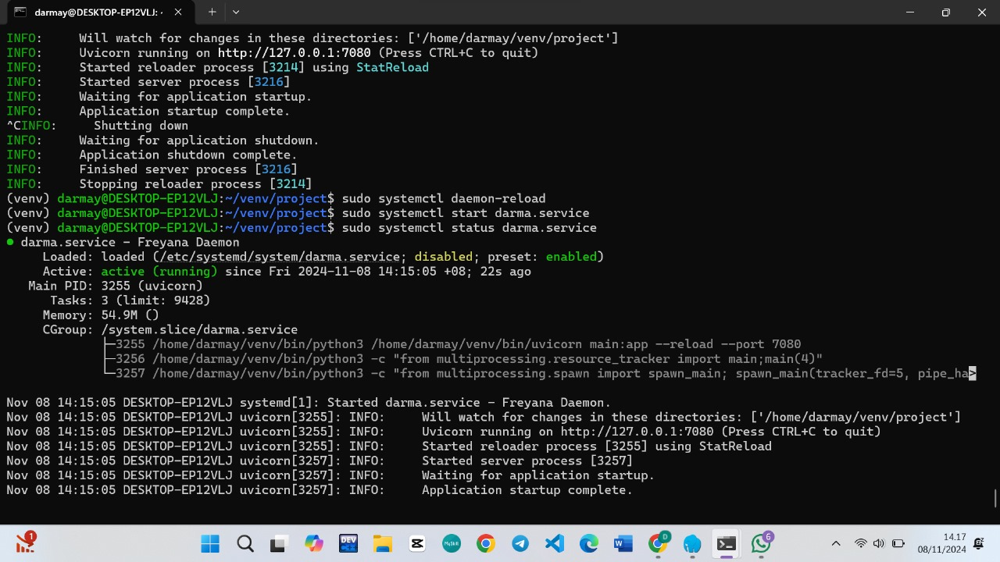
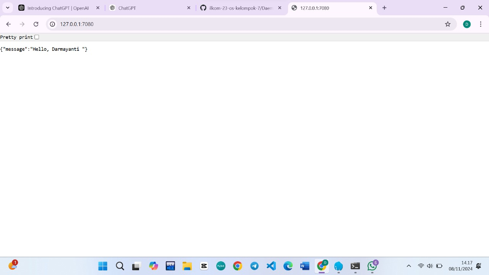

# Panduan pembuatan dameon process
NIM: F1G123004
Nama: Darmayanti

## Buat file .service
masuk sebagai superuser, lalu jalankan perintah
```bash
$ sudo touch /etc/systemd/system/darma.service
```

## Penulisan script konfigurasi .service
```bash
[Unit]
Description=Freyana Daemon

[Service]
User=darmay
Restart=always
WorkingDirectory=/home/darmay/venv/project
Environment="PYTHONPATH=/home/darmay/./lib/python3.12/site-packages"
ExecStart=/home/darmay/venv/bin/uvicorn main:app --reload --port 7080

[Install]
WantedBy=multi-user.target
```

## Penjelasan singkat mengenai  script konfigurasi .service
[Unit]
Description: Deskripsi singkat mengenai service. Dalam contoh ini disebut "Freyana Daemon".

[Service]
User: Menentukan pengguna yang akan menjalankan service ini. Di sini, service dijalankan oleh pengguna darmay.

Restart: Menentukan kebijakan restart. Opsi always memastikan service akan otomatis restart jika terjadi error atau stop.

WorkingDirectory: Direktori kerja di mana aplikasi akan dijalankan (/home/darmay/venv/project).
ExecStart: Perintah untuk menjalankan service. Di sini uvicorn digunakan untuk menjalankan aplikasi dengan konfigurasi reload di port 7080.

[Install]
WantedBy: Menentukan target saat service akan diaktifkan, di sini adalah multi-user.target.


## jalankan perintah daemon
```bash
$ sudo systemctl daemon-reload 
$ sudo systemctl enable darma.service 
$ sudo systemctl start darma.service
$ sudo systemctl status darma.service
```
## Bukti daemon telah berjalan


## Bukti Web nya



