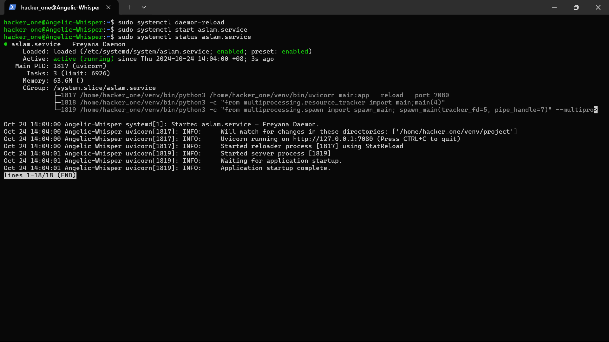
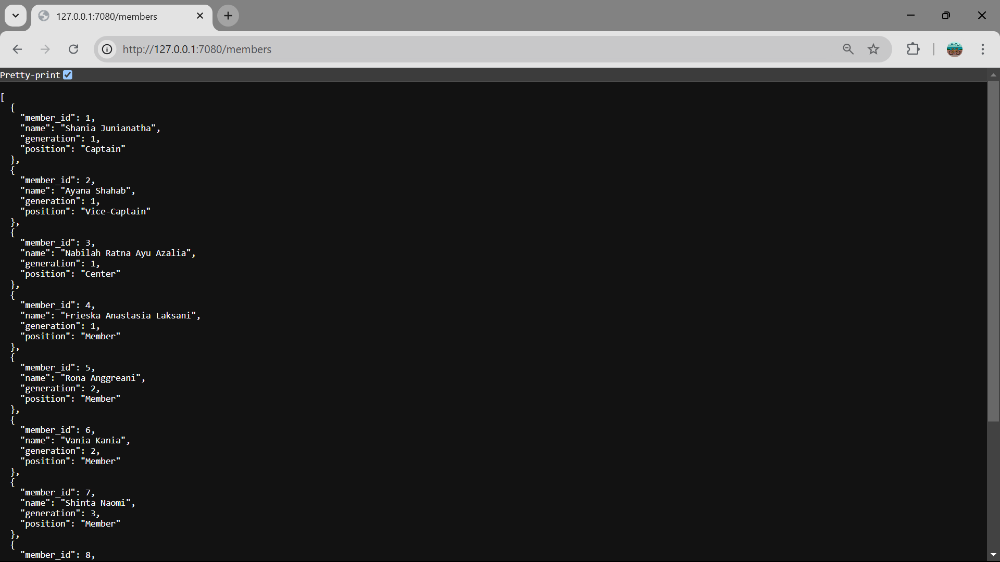

# Panduan pembuatan dameon process
NIM: F1G123021
Nama: Muhammad Aslam Hidayat

Pada tulisan ini saya akan memaparkan tahapan pembuatan daemon process

## Buat file .service
masuk sebagai superuser, lalu jalankan perintah
```bash
$ sudo touch /etc/systemd/system/aslam.service
```

## Penulisan script konfigurasi .service
```bash
[Unit]
Description=Freyana Daemon

[Service]
User=hacker_one
Restart=always
WorkingDirectory=/home/hacker_one/venv/project
Environment="PYTHONPATH=/home/hacker_one/./lib/python3.12/site-packages"
ExecStart=/home/hacker_one/venv/bin/uvicorn main:app --reload --port 7080

[Install]
WantedBy=multi-user.target
```

## Penjelasan singkat mengenai  script konfigurasi .service
[Unit]
Description: Menyediakan deskripsi singkat tentang service. Dalam kasus ini, service disebut "Freyana Daemon".

[Service]
User: Menentukan pengguna yang akan menjalankan service ini, yaitu hacker_one.

Restart: Menentukan kebijakan restart service. always berarti service akan selalu restart jika keluar, terlepas dari status keluar.

WorkingDirectory: Menetapkan direktori kerja untuk service. Dalam hal ini, service akan beroperasi di /home/hacker_one/venv/project.

Environment: Menentukan variabel lingkungan. PYTHONPATH diset untuk mencakup path ke package Python yang diperlukan, dalam hal ini di lib/python3.12/site-packages.

ExecStart: Perintah yang dijalankan saat service dimulai. Ini menjalankan uvicorn untuk menjalankan aplikasi FastAPI yang didefinisikan dalam main.py pada port 7080, dengan opsi --reload untuk memuat ulang aplikasi saat ada perubahan kode.

[Install]
WantedBy: Menentukan target di mana service ini akan dimuat. multi-user.target berarti service akan aktif saat sistem berada dalam mode multi-user (umumnya saat booting normal).


## jalankan perintah daemon
```bash
$ sudo systemctl daemon-reload 
$ sudo systemctl enable aslam.service 
$ sudo systemctl start aslam.service
$ sudo systemctl status aslam.service
```

## Bukti daemon telah berjalan


## Bukti Web nya

