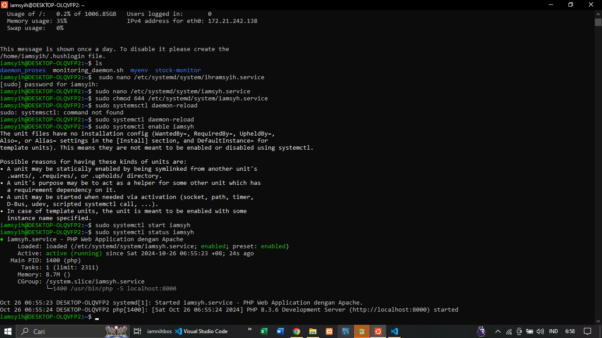

# Panduan pembuatan dameon process
NIM: F1G123026
Nama: Muhammad Ihram Syahputra

dalam hal ini saya akan memaparkan tahapan pembuatan daemon process.Pada studi kasus kali saya menjalankan website PHP Warung makan sederhana yang berjalan didaemon proses 

## 1. Buat directori untuk script
masuk sebagai superuser, lalu jalankan perintah
```bash
$ sudo nano /etc/systemd/system/iamsyh.service
```
## 2. Isi file.service (iamsyh.service) dengan konfigurasi web PHP berikut :
```bash
[Unit]
Description=PHP Web Application dengan Apache
After=network.target apache2.service
Requires=apache2.service

[Service]
User=www-data
Group=www-data
WorkingDirectory=/var/www/html/RPL-kelompok-11

# Environment untuk PHP
Environment=PHP_ENV=production
Environment=DB_HOST=localhost
Environment=DB_USER=root
Environment=DB_PASS=""
Environment=DB_NAME=db_warung

ExecStart=/usr/bin/php -S localhost:8000
Restart=always
RestartSec=3
```
## 3. Melakukan Permission (hak akses) file terhadap linux 
```bash
$ sudo chmod 644 /etc/systemd/system/iamsyh.service
```
## 4. jalankan perintah daemon 
```bash
$ sudo systemctl daemon-reload 
$ sudo systemctl enable iamsyh.service 
$ sudo systemctl start iamsyh.service
```
## 5. Bukti file service telah berjalan sebagai daemon
```bash
$ sudo systemctl status iamsyh.service
```


## 6. Bukti daemon telah berjalan 


## Hal yang perlu diperhatikan
1. Instalasi dasar : sebelum membuat konfigurasi,pastikan komponen utama sudah terinstal di server yaitu Apache2,PHP,dan MySQL(jika aplikasi membutuhkan database)

2. Pastikan struktur folder aplikasi sudah siap dan berada di lokasi yang tepat (umumnya /var/www/html/).Yang penting diperhatikan adalah permission folder harus sesuai agar bisa diakses oleh web server. Folder yang membutuhkan akses write seperti upload dan log harus memiliki permission yang tepat. 

3. Tentukan mode environment yang akan digunakan (production atau development). Ini penting karena akan mempengaruhi bagaimana aplikasi berperilaku, terutama dalam hal menampilkan error dan logging. Dalam production, error details sebaiknya disembunyikan dari user.

4. Jika aplikasi menggunakan database, pastikan MySQL sudah terinstal dan memiliki user dengan permission yang sesuai. Informasi koneksi database (host, username, password) perlu disiapkan untuk dimasukkan ke dalam konfigurasi environment.
